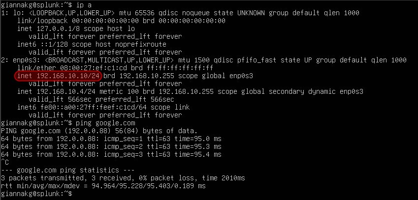

# Active Directory Defense and Attack Simulation Lab

### 🛡️ A Hands-on Cybersecurity Simulation of Red Team/Blue Team Operations

This project is a hands-on simulation I created to demonstrate both offensive (Red Team) and defensive (Blue Team) cybersecurity tactics. It focuses on real-world scenarios of detecting, analyzing, and responding to cyber threats using tools like Splunk, Sysmon, Atomic Red Team, and Kali Linux. The goal of the project is to simulate cyberattacks and demonstrate how to effectively defend against them using detailed log analysis and monitoring.

---

## 📊 Project Overview

I built a simulated small enterprise network environment, where I triggered various cybersecurity incidents to monitor and analyze them. The setup includes both Red Team attacks and Blue Team defenses, where I used tools to simulate attacks, collect logs, and analyze behaviors. This project was designed to reflect real-world cyberattacks and how to detect and mitigate them using a combination of offensive and defensive tools.

---

## 🖥️ Network Architecture

### 🌐 Domain Information:
- **Domain Name**: `geo.global`
- **Network Subnet**: `192.168.10.0/24`

### ⚙️ Devices and Configuration:
- **Splunk Server**:
  - **IP Address**: `192.168.10.10`
  - **Purpose**: Acts as the central log collection point, visualizing logs from all devices on the network.
  - I installed Splunk Universal Forwarder to receive logs from various systems and configured custom searches for detecting threats.
  
  

- **Windows 10 Machine**:
  - **IP Address**: Assigned dynamically using DHCP.
  - **Role**: I used this machine to simulate a typical user environment for red team/blue team activities. Sysmon is installed to monitor detailed events, and Atomic Red Team is used to simulate adversarial techniques.

- **Active Directory (Windows Server 2022)**:
  - **IP Address**: `192.168.10.7`
  - **Purpose**: This server handles user authentication and policies. I also installed Sysmon and Splunk Universal Forwarder here to capture logs from user activities and relay them to the Splunk server for analysis.

- **Kali Linux (Attacker)**:
  - **IP Address**: `192.168.10.250`
  - **Role**: I used Kali Linux for penetration testing and attack simulation, particularly focusing on simulating internal threats within the same subnet.

### 🖥️ Network Diagram

### 🎉 Having all set up and running! 4 VMs ready for party!

---

## 🚀 Attack and Defense Phases

### 🔴 Red Team Attack Phase: Password Brute Force with **Crowbar**

1. **Objective**: To simulate a brute force password attack against the Windows 10 machine and see how well my defense setup detects this activity.
  
2. **Methodology**:
   - I used **Crowbar** on Kali Linux to launch a brute force attack on the Windows 10 machine.
   - I selected 20 passwords from a pre-existing list, including the password for user "Susan Smith" (`wH0ish1r!nG`), to carry out the attack.
      <!-- Image placeholder -->
  
3. **Outcome**: The attack was successful after 20 attempts, and I was able to log in with Susan Smith's credentials, confirming that the brute force worked. This scenario mimics a common internal network attack, where an attacker gains unauthorized access by brute-forcing weak or known credentials. 

   
   
---

### 🔵 Blue Team Defensive Response Using **Splunk**

1. **Detection Strategy**:
   - To monitor the brute force attempt, I set up Splunk to look for **Event ID 4625**, which records failed login attempts. Splunk captured 20 failed logon events, which immediately signaled a brute force attack.
   
   - I also filtered for **Event ID 4624**, which captures successful login events. When I looked further into this, I noticed that the login came from an unknown workstation with an IP that was not part of the legitimate internal network.

2. **Forensic Analysis**:
   - I correlated the failed logon events with the successful login. The clustered timestamps and the origin of the successful login from an external IP strongly indicated that a brute force attack was followed by an unauthorized login.
     
   - By analyzing the workstation and network logs, I was able to confirm that the successful login originated from the attacker’s Kali Linux machine.
     
     

### Key Analytical Takeaways:
- By monitoring specific event IDs, I was able to quickly identify suspicious behavior that is characteristic of a brute force attack.
- Splunk's log aggregation and search capabilities helped me correlate multiple log events, providing insights into both failed attempts and successful unauthorized access.

---

### 🛠️ Atomic Red Team Simulation Phase: Exploiting **T1136.001 (Local Account Creation)**

1. **Scenario**: I installed the **Atomic Red Team** on the Windows 10 machine via Powershell to simulate adversarial techniques from the MITRE ATT&CK framework. The folder names are mapped according to Mitre ATT&CK IDs. https://attack.mitre.org/matrices/enterprise/

2. For example in our folder we have the names T1136.001, T1136.002 and T1136.003:
   
   
4. In Mitre ATT&CK IDs these are under the Persistence category techniques and are the Create account attack. 
  

5. **Execution**:
   - After configuring Windows Defender to allow Atomic Red Team operations, I used PowerShell to simulate the creation of a new local admin user (`NewLocalUser`).
   - This technique was designed to mimic an adversary gaining persistence in a system by creating new local accounts with admin privileges.

    <!-- Image placeholder -->

6. **Blue Team Response**:
   - I used Splunk to search for **Event ID 4720**, which tracks new user account creation. This allowed me to quickly detect when the new admin user was created.
     
   - By setting up filters and alerts for account creation and modification events, I was able to catch this privilege escalation technique in real-time.
     
     

7. **Security Recommendation**:
   - I recommend configuring alerts in Splunk to automatically trigger when suspicious account creation events are detected. This can help defend against privilege escalation and insider threats.

### Analytical Insights:
- The simulation of **T1136.001** highlighted the importance of proactively monitoring for privilege escalation events.
- With Splunk, I was able to fine-tune my detection capabilities, ensuring that administrative changes are logged and monitored for any unauthorized actions.

---

## 📝 Summary and Learning Outcomes

Throughout this project, I simulated both offensive and defensive techniques in a controlled cybersecurity lab environment. Here are the key outcomes:

- **Brute Force Attack Detection**: By using Splunk to monitor failed and successful login attempts, I was able to detect brute force attack patterns in real-time.
- **Privilege Escalation Detection**: Through the use of Atomic Red Team and Splunk, I demonstrated how to detect privilege escalation techniques like local account creation.
- **Event Correlation**: By correlating logs from multiple sources, I successfully identified malicious behavior and was able to trace back the origins of the attack.
- **Proactive Defense**: Using the data collected, I set up alerts and detection mechanisms for high-risk events, such as failed logon attempts and administrative account creation.

This project shows my ability to configure and simulate complex cybersecurity scenarios, test various attack techniques, and develop defensive strategies using industry-standard tools like Splunk, Sysmon, and Atomic Red Team.

---

## ✉️ Conclusion

The **Active Directory Defense and Attack Simulation Lab** enchanced my practical skills in red team/blue team operations and demonstrates my ability to handle real-world cyberattack simulations. By detecting and analyzing attacks in a controlled environment, I honed my abilities in event correlation, log analysis, and security monitoring.
