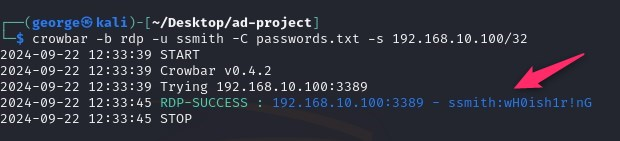
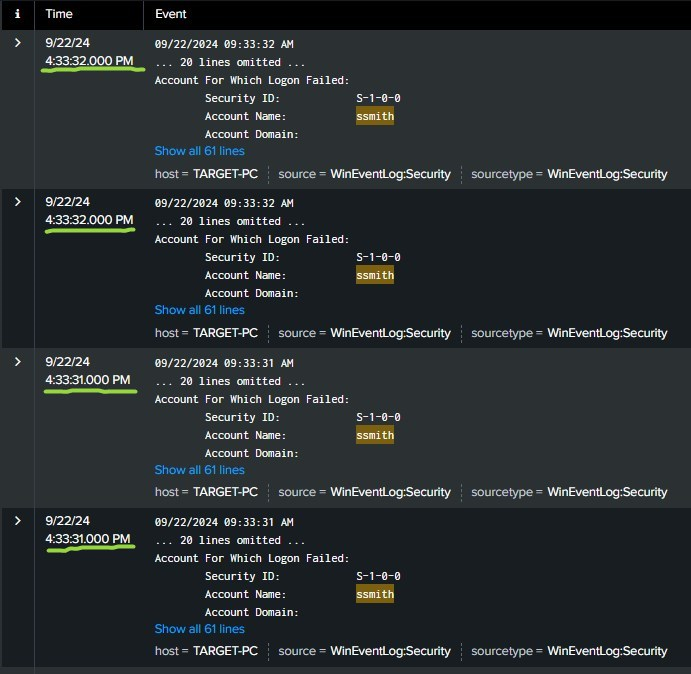

# Attack Description: Red Team vs Blue Team

This document provides an overview of the attack simulations I ran in the **AD-Cybersecurity-Simulation-Lab** and how I monitored them.

## ⚔️ Red Team Activity: Brute Force Attack

### 1.1 Attack Setup
In **Kali linux**, I used the **Crowbar** tool to brute force and attack at the Windows 10 target machine.  To showcase the attack I used the first 20 passwords of pre-existing passwords listed in Kali and added the password of Susan Smith (which is **wH0ish1r!nG**).

### 1.2 Running the Brute Force Attack
To perform the attack, I ran **Crowbar** with a password list and targeted the Windows Remote Desktop service. After a few failed attempts, I was able to crack the password `wH0ish1r!nG` and gain access to the machine.

The **Event ID 4625** is **“An account failed to log on”**.   https://www.ultimatewindowssecurity.com/securitylog/encyclopedia/event.aspx?eventID=4625

## 🛡️ Blue Team Response: Log Monitoring with Splunk

### Monitoring Logs in Splunk
Once the attack was underway, I used **Splunk** to monitor login attempts from the Windows 10 machine. By filtering the search (or maybe already had created alerts for specific IDs like incorrect logins) we see the **Event ID 4625** has 20 times unsuccessful login attempts:

Filtering the search for events with **Event ID 4625** we can see that the login attempts for user ssmith happened almost at the same type timely which is an indication of a brute force attack:

But there is also within the timeframe of the attack an **Event ID 462**4, which is a successful logon event.  Further looking into the details of the event we can see that the logged workstation is not our workstation but an attacker workstation with name and IP not from our network.

## 🎯 Conclusion
This simulation demonstrated how a brute force attack can be detected and mitigated using **Splunk** as a central log analysis tool.
