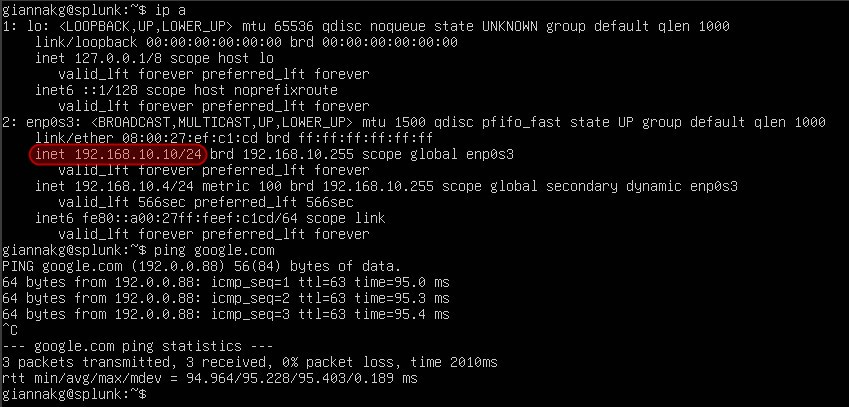

# AD-Cybersecurity-Simulation-Lab Setup Guide

In this guide, I’ll walk through the setup of my **AD-Cybersecurity-Simulation-Lab**, covering both the attack and defense components. By the end, you'll have a fully functional lab to test both **red team** and **blue team** scenarios.

## 🖥️ Lab Environment Overview
Here’s a quick look at the components I used:
1. **Windows Server 2022** - Active Directory Domain Controller (ADDC)
2. **Windows 10 Client** - A machine to simulate red team attacks and blue team defenses
3. **Kali Linux** - Used for penetration testing and red team activities
4. **Splunk Server** - For log collection and analysis
5. **Sysmon** - Installed on Windows systems for detailed logging
6. **Splunk Universal Forwarder** - Sends logs from Windows systems to the Splunk server

### Network Configuration
- **Domain**: `geo.global`
- **Subnet**: `192.168.10.0/24`
- **Devices**:
  - **Splunk Server**: `192.168.10.10`
  - **Windows Server 2022 (AD)**: `192.168.10.7`
  - **Windows 10 Client**: DHCP
  - **Kali Linux**: `192.168.10.250`

## 🛠️ Step 1: Set Up Windows Server 2022 (Active Directory Domain Controller)

### 1.1 Installing Windows Server 2022
I first installed **Windows Server 2022** on a virtual machine and assigned it a static IP (`192.168.10.7`). I used this machine to handle Active Directory services.

### 1.2 Configuring Active Directory Domain Services
Next, I went into **Server Manager**, clicked on **Add roles and features**, and selected **Active Directory Domain Services (AD DS)**. After installation, I promoted this server to a domain controller, setting the domain name to `geo.global`.

### 1.3 Creating Organizational Units and Users
Once the domain was set up, I created two organizational units in **Active Directory Users and Computers**: **IT** and **HR**. Then, I added two users, **John Doe** and **Susan Smith**, each assigned to their respective OUs.

## 🖥️ Step 2: Set Up Windows 10 Client

### 2.1 Installing Windows 10
I installed **Windows 10** on another virtual machine and connected it to the network. After that, I joined this machine to the `geo.global` domain, making it an active part of the environment.

### 2.2 Installing Sysmon
I installed **Sysmon** on the Windows 10 client to monitor detailed system activity. I configured it using the **Sysmon configuration file** I customized.

## 🔧 Step 3: Set Up the Splunk Server
### 3.1 Installing Splunk
On another virtual machine, I installed Splunk and configured it with the IP address 192.168.10.10. I accessed the web interface and set up my index for storing logs (endpoint), which I used to monitor logs coming from Windows clients. 

## 🚀 Step 4: Install Splunk Universal Forwarder on Windows Machines
### 4.1 Installing Splunk Forwarder
I installed the Splunk Universal Forwarder on both the Windows Server 2022 and Windows 10 clients. I configured each forwarder to send logs to the Splunk server, ensuring logs from both systems would be monitored centrally.

## 🔨 Step 5: Set Up Kali Linux for Red Team Activities
### 5.1 Installing Kali Linux
I used Kali Linux as the attacker machine. After installing it, I assigned it the static IP 192.168.10.250.

### 5.2 Using Crowbar for Brute Force Attacks
I installed Crowbar, a brute force password attack tool. After setting it up, I used it to simulate attacks against the Windows 10 machine.

For more detailed steps on the brute force attack, check the brute-force-attack.md.

## 🛡️ Step 6: Monitoring with Splunk (Blue Team)
### 6.1 Checking Logs in Splunk
I monitored the Windows machine logs by searching for Event ID 4625 (failed login attempts) and Event ID 4624 (successful logins). This allowed me to see the results of the brute force attack directly in the Splunk dashboard.

### 6.2 Setting Up Alerts
I also configured alerts in Splunk to notify me when specific patterns were detected, such as multiple failed logins followed by a successful one.

## 🎯 Conclusion
By following these steps, I set up a fully functional cybersecurity lab that allowed me to simulate red team attacks and monitor them from the blue team perspective. This lab serves as a sandbox to test real-world scenarios, making it a great learning experience.
